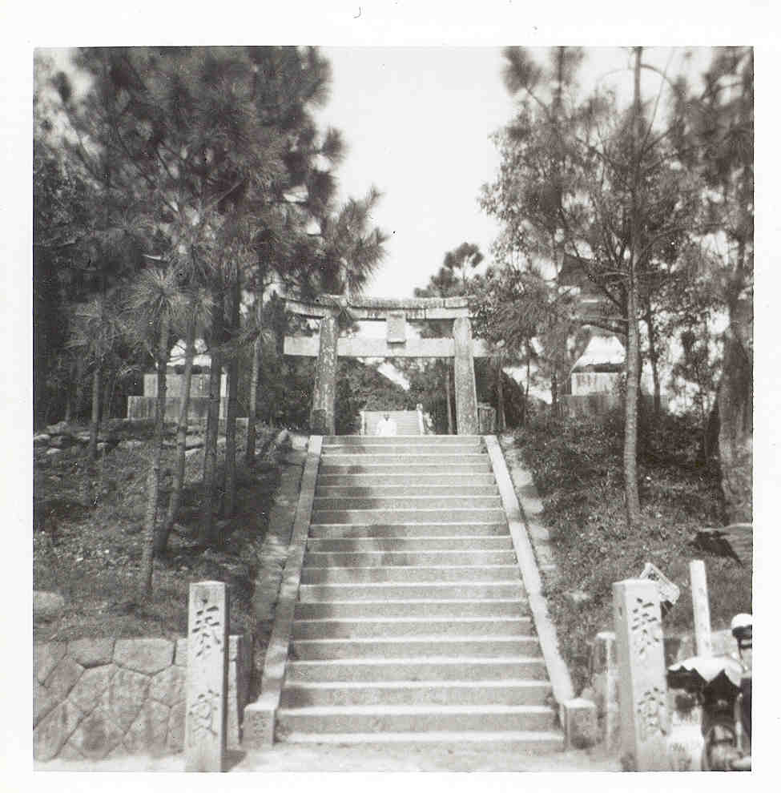

# The Monk at Shikaumi Shrine

In the summer of 1970, my brother and I were exploring the quiet, forested paths of Shikanoshima Island when we happened upon something remarkable—a stone staircase rising out of the greenery, leading upward to a place we couldn’t see. We didn’t know it then, but this was the Shikaumi Shrine, a place that seemed to hold a quiet dignity, even to us as children. Out of respect, and perhaps a little uncertainty, we chose not to climb the steps, mindful of the importance of preserving what we could only guess was sacred ground.

The air felt fresh and alive after a recent rain, the sun now filtering gently through the trees. As we stood at the base of the steps, taking in the tranquil beauty around us, two men descended from the shrine above. One of them, dressed in the white robes of a monk, carried a presence that was both serene and striking. Without a word, he approached me, his expression calm and kind. Then, with a gentle hand, he tousled my hair and looked at me with a quiet smile. We stood there for a moment, just looking at one another.

I still don’t know what passed between us in that moment, but it was something I have carried with me ever since. It wasn’t an encounter I could explain then, nor is it one I can fully articulate even now. There was something about the monk—his peaceful gaze, his presence—that seemed to touch something deep within me. Perhaps it was simply the quiet connection of two lives crossing for the briefest moment. Whatever it was, it stayed with me.

Now, as an old man, I look back on that day with gratitude. I often wonder what the monk might have seen in me—a young, wide-eyed boy in a foreign land, standing hesitantly at the edge of something he didn’t yet understand. Perhaps I was only a passing face in his long life of service, or perhaps he saw something in me that even I didn’t see in myself. Whatever the case, I’m grateful for his kindness, for the small gesture that left such a lasting impression.

In Japan, there is a phrase, ichigo ichie (一期一会), meaning “one time, one meeting.” It speaks to the beauty of fleeting moments, encouraging us to treasure each encounter as something unique and precious. That moment at Shikaumi Shrine was my ichigo ichie—a brief and quiet meeting that continues to resonate in my life.

Someday, I hope to return to Shikanoshima Island, to see the shrine again, and to reflect on the steps I never climbed. But most of all, I hope to honor that moment of connection, however small it might have seemed, and the enduring lesson it left with me.
